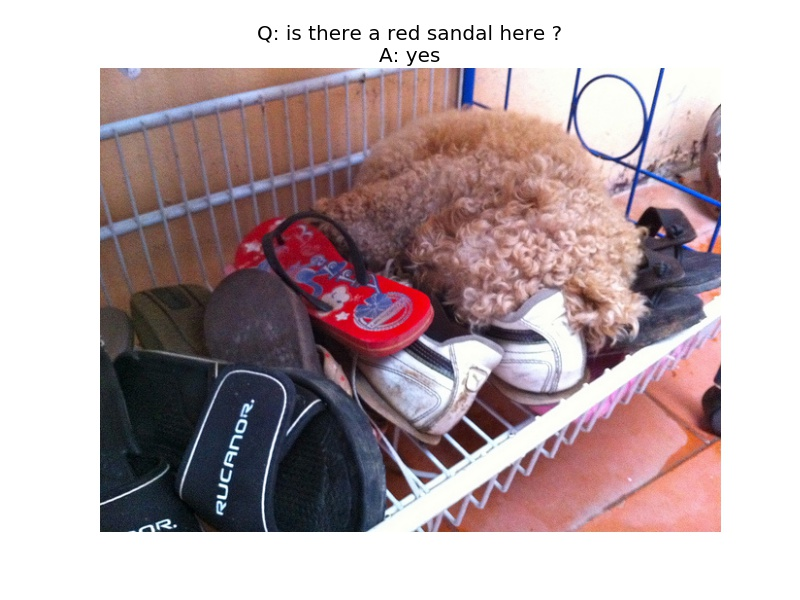
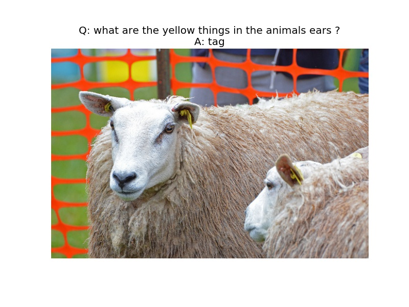
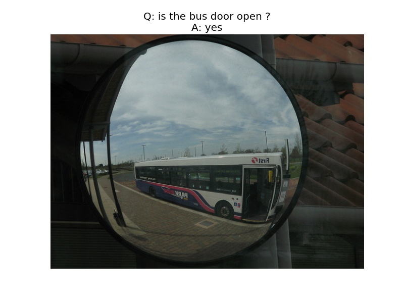
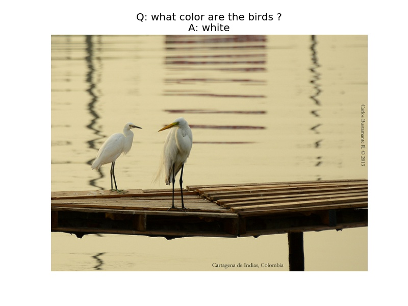
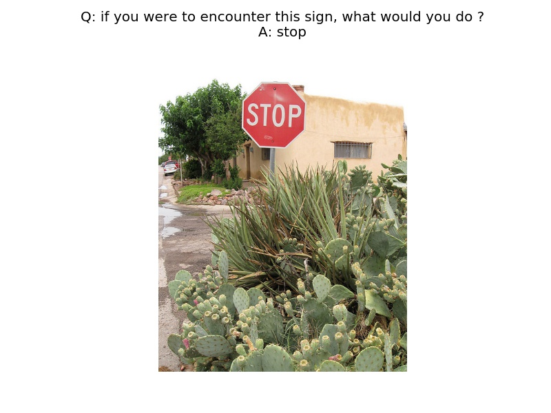
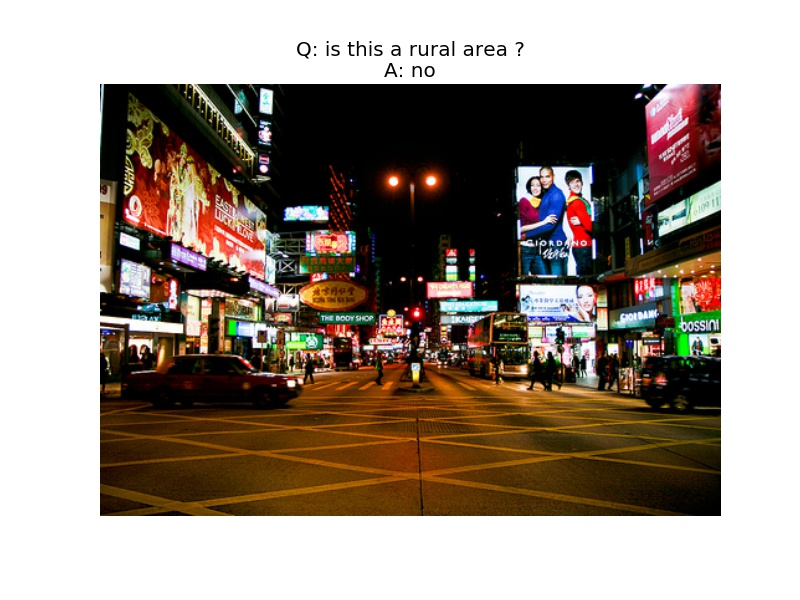
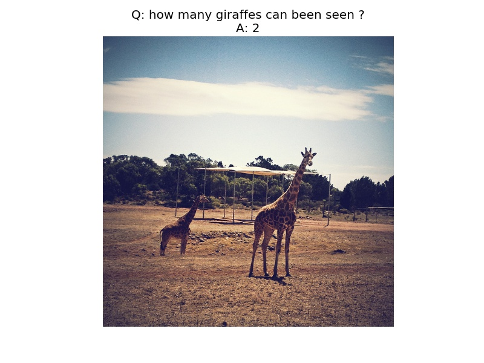
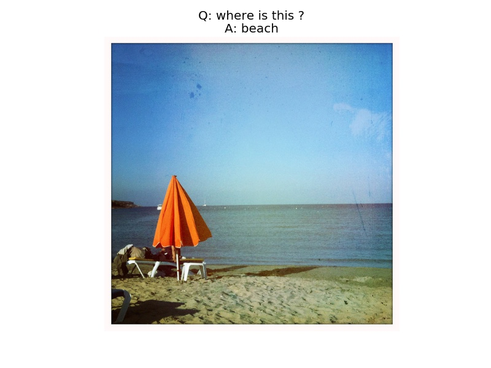

This is a neural network architecture for visual question answering roughly based on the paper "Dynamic Memory Networks for Visual and Textual Question Answering" by Xiong et al. (ICML2016). The input includes an image and a question about the image, and the output is the answer to the question. It first uses a convolutional neural network to extract a set of features of the image, which are called "contexts" or "facts". These facts are fused by a bidirectional GRU. It also uses a GRU recurrent neural network to encode the question. Then the encodings of image and question are fed into an episodic memory module, which consists of the attention mechanism (responsible for producing a contextual vector) and the memory update mechanism (responsible for generating the episode memory based upon the contextual vector and previous episode memory). Both the soft and GRU-based attention mechanisms are implemented. Finally, the model generates a one-word answer based on the last memory and the encoding of question. 

This project is implemented in Tensorflow, and allows end-to-end training of both CNN and RNN parts. To use it, you will need the Tensorflow version of VGG16 or ResNet(50, 101, 152) model, which can be obtained by using Caffe-to-Tensorflow. 

Examples
----------

References
----------

* [Dynamic Memory Networks for Visual and Textual Question Answering](https://arxiv.org/abs/1603.01417) Caiming Xiong, Stephen Merity, Richard Socher. ICML 2016.
* [Visual Question Answering (VQA) dataset](http://visualqa.org/)
* [Implementing Dynamic memory networks by YerevaNN](https://yerevann.github.io/2016/02/05/implementing-dynamic-memory-networks/)
* [Dynamic memory networks in Theano](https://github.com/YerevaNN/Dynamic-memory-networks-in-Theano)
* [Dynamic Memory Networks in Tensorflow](https://github.com/therne/dmn-tensorflow)
* [Caffe to Tensorflow](https://github.com/ethereon/caffe-tensorflow)

